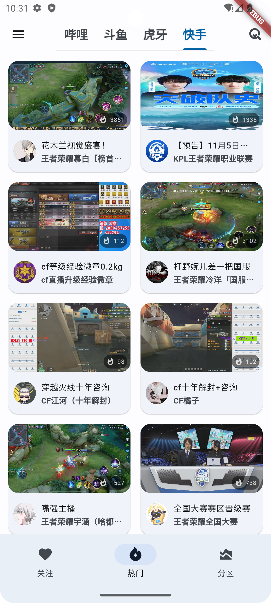
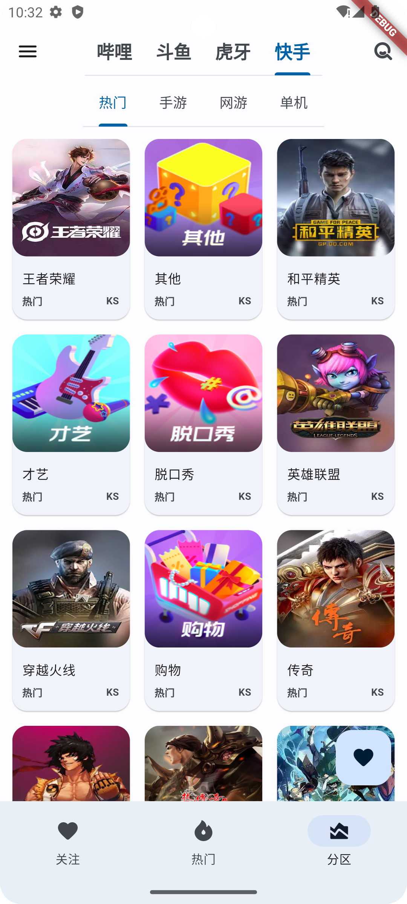
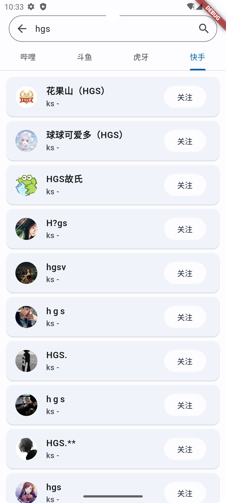

# Pure Live

Pure Live is a live stream transcoding application based on Flutter for android and windows, which can make you watch lives with ease. All data fetched by local machine, no cloud save, all live data and video belongs to original platform.

Pure Live是一款款平台基于Flutter的直播转码软件，轻松看直播。所有数据均由本地机器获取，不存储在云端，直播数据、视频版权归原平台所有。

本项目基于[pure_live](https://github.com/Jackiu1997/pure_live)制作，增加了快手平台，仅此而已，如需使用，可直接在release下载

目前支持设备:
- Android

## Screenshots

### Mobile UI

  <table>
    <tr>
    <td style="text-align: center">
      
    </td>
    <td style="text-align: center">
      
    </td>
    <td style="text-align: center">
      
    </td>
    <td style="text-align: center">
      
    </td>
    </tr>
  </table>

## Platforms

- [x] [哔哩哔哩](https://app.bilibili.com/)

- [x] [虎牙APP](https://www.huya.com/download/)

- [x] [斗鱼APP](https://www.douyu.com/client)

- [x] [快手直播](https://live.kuaishou.com/)   
  - 目前已支持：
    - 热门列表
    - 搜索(由于快手需要登录才能搜索，可能搜索功能会过期)
    - 分类
  - TODO:
    - 弹幕
    - 等等...(随缘)

## Statement
This project is only for learning and communication. Please do not use it for commercial purposes. The copyright of related resources is owned by the original company.

这个项目仅作为个人兴趣业余开发，不用于商业用途。相关资源的版权归原公司所有。

No user privacy is ever collected, the app directly requests the official interface except for detection updates, and the data generated by all operations is kept locally by the user.

本项目是一个纯本地直播转码应用，不会收集任何用户隐私，应用程序直接请求直播官方接口，所有操作生成的数据由用户本地保留。

## Thanks
 - [pure_live](https://github.com/Jackiu1997/pure_live)
 - [ice_live_viewer](https://github.com/iiijam/ice_live_viewer)
 - [JustLive-Api](https://github.com/guyijie1211/JustLive-Api)
 - [real-url](https://github.com/wbt5/real-url)
 - [dart_tars_protocol](https://github.com/xiaoyaocz/dart_tars_protocol)
 - [bilibili-API-collect](https://github.com/SocialSisterYi/bilibili-API-collect)
 - [alltv_flutter](https://github.com/Ha2ryZhang/alltv_flutter)
